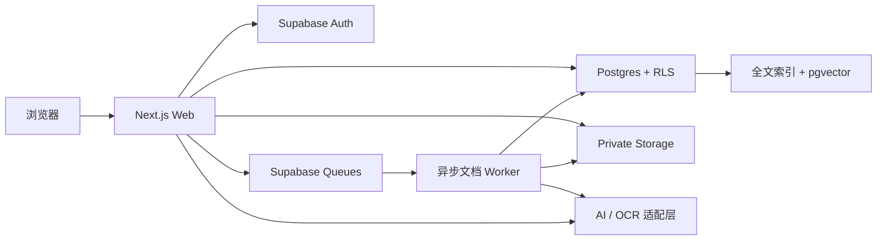

# 通用 AI 知识库产品设计规格

- 日期：2026-09-02
- 状态：产品设计已逐节确认，等待书面规格终审
- 产品类型：支持个人与团队的多租户云端知识库
- 首期形态：桌面优先、完整响应式 Web 产品

## 1. 产品目标

产品帮助个人与团队把零散图片和文件变成可检索、可追溯、可协作的知识资产。用户上传资料后，系统在后台识别内容，自动生成摘要、主题、标签、实体及关联，再通过资料库、知识图谱和带引用的 AI 对话提供探索能力。

首期面向通用知识工作，不绑定特定行业。产品成功的核心不是“模型能生成多少内容”，而是：

1. 用户可以低成本放入资料并持续积累。
2. AI 产物始终能回到原始证据，并允许人工纠正。
3. 个人内容、团队内容和私密对话之间没有权限泄漏。
4. 团队能把有价值的私人问答主动沉淀为共享知识。

## 2. 设计原则

- **默认私密**：新用户首先进入仅本人可见的个人空间；没有显式发布或上传到团队空间，就不会扩大可见范围。
- **权限先于检索**：先确定当前用户有权访问的工作区和资料，再进行全文或向量召回。
- **证据先于结论**：摘要、实体、关系和聊天回答均保留来源；没有证据的关系不能成为可接受候选。
- **AI 是可纠正的建议层**：AI 结果带状态、置信度和模型来源；人工修订优先且不被重处理覆盖。
- **上传与理解分离**：原件安全保存后上传即完成，解析和 AI 处理异步推进，不阻塞用户离开页面。
- **工作区是硬租户边界**：不提供跨工作区搜索、实体合并、缓存复用或图谱关系。
- **原件不可变，派生知识可协作**：团队不在本产品中共同编辑原始 Office 文件，只协作编辑摘要、笔记、标签、关系和评论。

## 3. MVP 范围

### 3.1 包含

- 邮箱验证码登录与 Google 登录。
- 注册后自动创建一个个人空间。
- 创建多个团队空间、邮箱邀请和 Owner / Admin / Editor / Viewer 四级角色。
- 上传 JPG、PNG、WebP、PDF、DOCX、Markdown 和 TXT。
- 单批最多 20 个文件，内测期单文件最大 50 MB。
- 文件预览、处理进度、失败原因与重新处理。
- 自动生成摘要、主题、标签、人物、组织、地点、概念及其关系。
- AI 结果的接受、修改、驳回、实体合并和证据查看。
- 关键词与语义混合搜索。
- 当前工作区的知识图谱，以及继承资料筛选条件的局部图谱视图。
- 基于当前工作区资料的私密 AI 对话、流式回答和可点击引用。
- 把私人问答显式发布为团队问答，并支持后续编辑和撤回。
- 团队笔记、评论、修改历史和关键审计事件。
- 桌面、平板和手机响应式体验。

### 3.2 首期不包含

- PPT、Excel、音频、视频和网页自动同步。
- 原始 Office 文件的多人实时编辑。
- 公开链接、匿名分享和跨团队搜索。
- 文档级自定义 ACL、复杂组织层级和企业 SSO。
- 自定义本体编辑器、自由绘图式图谱编辑器和复杂图算法。
- 计费套餐、第三方集成市场和公开 API。
- 深色模式。
- 独立收件箱、自由层级页面系统和独立草稿模块；早期视觉稿中的相关入口仅为方向探索，不进入 MVP 导航。

## 4. 用户、空间与默认落点

### 4.1 空间语义

- 每个用户固定拥有一个个人空间，个人空间只有该用户一个 Owner，不能邀请其他成员。
- 用户可以创建或加入多个团队空间。
- 团队资料归团队空间所有，`uploaded_by` 只记录上传者，不构成资料所有权。
- 团队空间内的资料默认对该团队所有有效成员可见；MVP 不提供单份资料的额外权限设置。
- 私密会话即使使用团队资料，也始终只对会话创建者可见；团队 Owner 和 Admin 不能读取成员私聊。

### 4.2 登录后的落点

- 新注册用户进入个人资料库的首次使用空状态。
- 通过邀请进入的用户先完成邀请确认，再进入对应团队资料库。
- 返回用户进入上次打开且仍有权限的工作区；权限已失效时回退到个人空间。
- 全局上传入口默认使用当前工作区，并始终显示目标空间。目标为团队时，用清晰的“团队成员可见”提示阻止误传。
- 产品不会自动把个人资料移动或复制到团队空间。

## 5. 角色权限

| 能力 | Owner | Admin | Editor | Viewer |
|---|---:|---:|---:|---:|
| 查看资料、搜索、查看图谱 | 是 | 是 | 是 | 是 |
| 创建和维护本人的私密会话 | 是 | 是 | 是 | 是 |
| 上传资料、编辑派生知识、评论 | 是 | 是 | 是 | 否 |
| 发布团队问答 | 是 | 是 | 是 | 否 |
| 将资料移入回收站及恢复 | 是 | 是 | 是 | 否 |
| 永久删除资料、手动重跑任务 | 是 | 是 | 否 | 否 |
| 邀请或移除 Editor / Viewer | 是 | 是 | 否 | 否 |
| 任命、降级或移除 Admin | 是 | 否 | 否 | 否 |
| 转移所有权、删除团队空间 | 是 | 否 | 否 | 否 |

附加约束：

- 团队始终恰有一个 Owner；最后一名 Owner 不能退出、被移除或直接降级。
- Admin 不能修改 Owner、其他 Admin 或自己的角色。
- Viewer 唯一允许的内容写入是本人私密会话及消息。
- 团队问答的作者可以编辑或撤回自己的发布内容；Owner 和 Admin 可以管理空间内所有已发布问答。
- 所有权限由数据库、存储和服务端接口执行；前端隐藏按钮不构成权限控制。

## 6. 核心产品旅程

1. 用户通过邮箱验证码或 Google 登录，获得个人空间。
2. 用户选择继续使用个人空间，或创建、接受邀请进入团队空间。
3. 用户在明确显示目标空间的上传器中批量选择文件。
4. 原件保存后立即出现在资料库，并显示当前处理阶段；用户可以离开页面。
5. 处理完成后，资料进入 `READY`，用户查看原文、摘要、主题、标签、实体和关系建议。
6. 用户接受、修改或驳回 AI 建议，也可以补充笔记和评论。
7. 用户通过搜索、主题页或图谱发现跨资料关联。
8. 用户在当前工作区发起私密提问，获得流式、带引用的回答。
9. 用户可以保留私聊，也可以整理标题和答案后发布为团队问答。

登录后直接进入工作台，不设置营销式中间首页阻断核心任务。

## 7. 产品模块与交互

### 7.1 空间与成员

- 侧栏顶部提供工作区切换。
- 团队设置展示成员、角色、待处理邀请和邀请记录。
- 邀请有效期为 7 天，只能使用一次，并绑定被邀请邮箱。
- “分享”在 MVP 中只表示团队内部成员和邀请管理，不生成公开链接。

### 7.2 智能资料库

- 资料库是登录后的核心页面，默认提供全部资料、待审核、最近更新和图谱视图。
- 每份资料既是数据库条目，也是可打开的详情页。
- 条目显示文件类型、标题、主题、处理状态、更新时间和上传者。
- 详情页包含属性、原文件预览、提取文本、AI 摘要、标签、实体、关系、团队笔记、评论和处理历史。
- 桌面端优先使用侧边预览保持列表上下文，必要时全页打开；移动端统一全页打开。
- “新版本”指用户主动为同一逻辑资料上传的新原件；AI 重处理不会创建新的原件版本。
- 摘要和笔记使用独立内容修订，不与不可变的原件版本混淆。
- 新原件版本成功发布后，旧版本立即退出搜索、图谱和新聊天召回，并标记为 `SUPERSEDED`。旧原件与 Chunk 在版本历史中保留 30 天，仅 Editor 以上角色可查看。
- 已有引用在保留期内显示“历史版本”。系统尝试把引用和人工修订映射到新版本；无法重新定位的内容标记为“需要重新确认”，不自动迁移。
- 旧版本到期前，依赖它的团队问答必须完成引用迁移或进入隐藏待审核状态；到期后清除旧原件、Chunk 和向量。私密会话可保留当时的回答文字，但历史来源链接改为不可用，不把旧原文继续作为新回答依据。

### 7.3 AI 建议审核

- 主题、标签、实体和摘要生成后立即可见，并以“AI 建议”标记参与资料发现。
- `suggested`、`accepted`、`rejected` 是统一状态。被拒绝内容从默认体验和检索增强中排除。
- 每个 AI 摘要、主题、标签、实体和关系都必须有 `derived_artifact` 与至少一条可点击 `derived_evidence`；`source` 一词只表示产物来源类型，不能代替证据关联。
- 建议关系在图谱中使用弱化或虚线样式；接受后转为正常关系。用户可以隐藏所有未确认建议。
- 人工创建或修改的内容记录作者与版本，并优先于后续模型结果。
- 重新处理时，如果新证据仍能定位，人工修订继续有效；证据消失时标记为“需要重新确认”，不静默删除或迁移到错误内容。

### 7.4 知识图谱

- 节点类型包括资料、主题、标签、人物、组织、地点和概念。
- 关系边必须关联至少一个原文证据块，保存谓词、状态和置信度。
- 主导航中的图谱展示当前整个工作区；资料库中的图谱视图继承当前筛选和搜索条件。
- 点击节点或关系可以打开来源资料、页码、段落或图片区域。
- 支持接受、驳回关系和合并同一工作区内的重复实体。
- 单次画布最多展示 300 个节点；超过上限时先聚类、筛选或分页。
- 移动端不强行缩小画布，提供等价的节点和关系列表。

### 7.5 私密 AI 对话

- 每个会话绑定一个 `owner_user_id` 和一个 `workspace_id`，不能跨工作区组合资料。
- 回答模式默认严格基于当前工作区资料；证据不足时明确说明，而不是补充未经标记的通用模型知识。
- 每个事实性结论尽可能附带引用；引用可打开原资料并定位页码、段落或图片区域。
- 回答流式返回，用户可以继续追问、重新生成、复制和查看检索范围。
- 会话只保存在本产品数据库；调用模型时关闭供应商侧可选持久化，并向用户披露供应商仍适用的安全监控保留政策。

### 7.6 团队问答

- 发布是显式动作。发布界面允许编辑标题、整理后的答案和说明，并预览所有引用。
- 发布前重新验证发布者角色及每一条引用的团队可见性。
- 发布后创建独立的团队资产，不开放原始私聊及其其他消息。
- 已发布问答继续归团队所有，即使作者离开团队；审计中保留作者标识，账号删除后改为匿名历史作者。
- 来源资料进入回收站时，对应问答立即标为“引用不可用”并从默认搜索隐藏；永久删除后移除引用片段。若没有剩余有效证据，问答自动撤回，等待 Editor 以上角色重新审核。

## 8. 视觉与体验系统

### 8.1 视觉方向

整体采用 Notion 式文档工作区的组织逻辑：树状侧栏、页面、属性、数据库视图、内容块和侧边预览。只借鉴信息组织语言，不复制 Notion 的品牌资产、具体界面或插画构图。

设计参数：

- `DESIGN_VARIANCE = 5`：稳定为主，局部用插画和内容构图形成识别度。
- `MOTION_INTENSITY = 3`：动效克制，只服务状态、层级和反馈。
- `VISUAL_DENSITY = 6`：适合日常知识工作的中高信息密度。

核心视觉规则：

- 画布使用暖白 `#FFFEFC`，侧栏使用暖灰 `#F7F7F5`。
- 主文字 `#37352F`，次要文字 `#6B6A66`，分隔线 `#E9E9E7`，悬停背景 `#EFEFED`。有信息含义的文字不得使用更浅的颜色，确保暖白画布和暖灰侧栏上的正文达到 WCAG AA。
- 钴蓝 `#2869D8` 只用于主要操作、链接、焦点和必要的进行中状态；导航选中主要依靠中性背景与字重。
- 卡片不是默认容器。内容主要通过留白、分隔线和页面层级组织。
- 普通控件采用 4 至 7 px 紧凑圆角；阴影只用于菜单、浮层和侧边预览。
- 字体使用 Geist 或系统无衬线，中文依次回退到 PingFang SC、Microsoft YaHei 和系统字体。
- 交互状态完整覆盖悬停、聚焦、按下、加载、空、失败、只读和权限不足。

### 8.2 Remix Icon

- 产品统一使用官方 `@remixicon/react`，不混用 Emoji、字符图标或第二套图标库。
- 默认使用 Line 变体；Fill 仅用于 Remix 本身只有单一版本的符号或明确的状态表达。
- 内联图标为 16 px，侧栏与工具栏为 18 px，主要操作为 20 px。
- 图标颜色继承 `currentColor`。
- 装饰图标设置 `aria-hidden`；纯图标按钮必须提供可访问名称和提示。
- 产品标志必须原创。Remix Icon 只作功能图标，不用于 logo、商标或应用图标。

### 8.3 原创线稿插画

首期使用三张同系列、724 × 543、透明背景的原创极简手绘线稿：

1. 首次上传：人物把第一份资料放入档案盒。
2. 空知识图谱：成员协作连接资料节点。
3. 新建私密对话：人物基于多份来源资料提问。

已批准的设计资产：

- [首次上传插画](../assets/illustration-first-upload.png)
- [空知识图谱插画](../assets/illustration-knowledge-graph.png)
- [私密对话插画](../assets/illustration-grounded-chat.png)

插画只用于真正的首次使用或空状态，完成对应操作后自然退出。它们不出现在高密度资料列表、日常编辑页和已有内容页面中，也不承担唯一的信息表达。每张插画必须同时提供标题、说明、操作入口和有意义的替代文本。

### 8.4 响应式

- 验收宽度覆盖 360、768、1024 和 1440 px。
- 768 px 以下侧栏变为抽屉；核心功能使用底部或顶部的可达入口。
- 移动端必须完成登录、上传、搜索、阅读、编辑派生知识和聊天。
- 除图谱画布外不允许意外横向滚动；图谱在小屏提供关系列表。
- 交互热区至少 44 × 44 px，并支持减少动态效果。

## 9. 系统架构

### 9.1 组件边界

- **Next.js Web**：认证后的工作台、服务端接口、流式聊天、上传协调和权限感知的页面渲染。
- **Supabase Auth**：邮箱验证码和 Google OAuth 身份。
- **Postgres + RLS**：统一事实来源、所有业务数据、工作区权限、全文检索、知识图谱和审计元数据。
- **Private Storage**：原件、缩略图和安全预览文件。
- **Supabase Queues / PGMQ**：使用持久化 Basic Queue 保存后台消息，不向浏览器开放。
- **异步 Worker**：独立、可水平扩展的长运行服务，执行校验、解析、OCR、分块、AI 分析和索引。
- **AI 适配层**：隔离多模态理解、文本生成、嵌入和 OCR 能力。首发使用 OpenAI，模型标识由部署配置管理，不写死在业务逻辑中。

### 9.2 关键架构约束

- MVP 不引入 Neo4j；图谱节点、关系和证据全部存入 Postgres。
- 队列可能重新投递消息，因此业务按“至少一次执行”设计，依靠阶段幂等保证最终一致。
- `processing_jobs` 是任务事实来源；队列消息只携带 `job_id`。Worker 从数据库读取不可变的 `workspace_id`、`document_id` 和 `revision_id`，不信任客户端或任意队列载荷中的租户字段。
- 所有工作区内的实体采用 `(workspace_id, id)` 复合唯一约束；子表外键同时包含 `workspace_id`，由数据库拒绝任何跨空间资料、版本、Chunk、实体、关系、引用和任务关联。
- Worker 不允许使用通用高权限身份任意读写业务表。数据库为 Worker 提供受限角色和经过审计的专用函数，仅暴露领取任务、读取固定输入、写入当前阶段结果及原子发布版本等能力。
- 专用函数校验 `job → document → revision` 的工作区一致性，固定 `search_path`，撤销公开执行权限，并拒绝调用者覆盖任务归属字段。
- 如果队列或 Storage 操作必须使用平台服务密钥，该密钥只能处理已由数据库任务校验出的固定对象路径，不能据客户端参数列举或读取其他对象。
- Web、Worker、数据库、存储和 AI 调用共享关联 ID。

## 10. 文件处理状态机

### 10.1 状态

`UPLOADING → QUEUED → VALIDATING → EXTRACTING → CHUNKING → ANALYZING → INDEXING → READY`

辅助状态：

- `RETRYING`：暂时失败且仍在自动重试。
- `FAILED`：达到重试上限或内容不可解析，保留原件并显示失败阶段。
- `CANCELLED`：用户或管理员取消未发布的处理任务。
- `SUPERSEDED`：同一资料的新原件版本已经成功替代当前版本；按第 7.2 节的历史版本规则保留和清理。

低置信度不是处理失败。对应阶段仍可成功，结果以 `suggested` 或“待审核”状态发布。

### 10.2 处理步骤

1. 客户端先向服务端申请上传会话。服务端验证角色，预创建 `document`、`document_revision`、`upload_session` 和固定的随机对象路径，再签发只允许写入该路径的上传授权。
2. 浏览器直传私有隔离区域。完成回调后，服务端核对上传会话、对象路径、大小和对象元数据；超时或未完成会话在 24 小时内回收记录和孤儿对象。
3. Worker 流式读取对象，计算 SHA-256，并在同一工作区内检查重复文件，不进行全局哈希探测。
4. 校验扩展名、声明 MIME、真实文件签名、大小、密码保护和主动内容风险。未通过的文件不发送给 AI。
5. 图片与扫描 PDF 进入 OCR 或多模态理解；文本 PDF、DOCX、Markdown 和 TXT 做结构化提取。
6. 按标题、段落、页码和图片区域分块，保存可点击来源定位。
7. AI 生成摘要、主题、标签、实体、关系、证据和置信度，并通过结构化 Schema 校验。
8. 为有效文本块生成全文索引和向量；候选实体只在当前工作区内合并。
9. 所有必要阶段成功后，在数据库事务中切换 `documents.current_revision_id`。只有当前 `READY` 版本进入搜索、图谱和聊天。

处理中产生的数据始终绑定非当前 `revision_id`，不会被下游误读。重新处理或新版本失败时，上一成功版本继续服务。

### 10.3 重试与恢复

- 每个“原件版本 + 阶段”只有一份有效结果，并使用唯一幂等键。
- 暂时错误最多自动重试 3 次，采用退避策略；达到上限后进入 `FAILED`。
- 超过 15 分钟没有心跳的任务标记异常并告警。
- Owner 或 Admin 可以从失败阶段手动重跑，无需重新上传原件。
- 通过请求记录、结果缓存和幂等写入减少重复模型调用；不承诺供应商超时后的请求一定不会重复计费。
- 不支持的格式立即拒绝。可疑文件保存在不可访问的隔离区最多 24 小时，仅保留安全诊断元数据，之后自动清理。

## 11. 搜索、图谱和聊天的数据流

### 11.1 混合检索

1. 服务端根据 `auth.uid()` 和实时 Membership 确定单一工作区范围。
2. 只选择当前 `READY` 原件版本和仍有效的团队问答。
3. 搜索文本先做 Unicode 规范化。拉丁文字使用 `simple` 配置的 `tsvector`；中文及其他 CJK 内容使用 `pg_trgm` 索引的字词片段匹配。两类结果都与 pgvector 语义搜索并行执行。
4. 使用 Reciprocal Rank Fusion 合并结果，并保留文件、页码、段落、图片区域和权限信息。
5. 返回结果前再次验证对象仍可访问。

不得先在全库执行 Top-K，再在应用层过滤工作区。

### 11.2 聊天

1. 用户问题先经过空间权限和用量限制。
2. 混合检索返回最小必要文本块。
3. 系统提示把上传内容明确标记为不可信资料，文档中的“忽略规则”或工具调用文本不能改变系统权限或行为。
4. 模型只接收回答所需的片段，不发送无关文件、其他空间内容、内部 ID 或成员邮箱。
5. 输出流式返回；引用结构必须通过 Schema 校验，并在展示时再次鉴权。
6. 证据不足时返回明确的“不足以回答”，而不是伪造引用。

模型、OCR 和嵌入实现均位于可替换适配层；业务表记录输入 revision/chunk ID、供应商、模型、提示模板版本、Schema 版本、配置哈希和生成时间，以支持结果追溯、审计及受控回归，但不承诺随机模型输出逐字复现。

## 12. 协作与版本冲突

- 原始上传文件不可在线协同修改，只能通过新 `document_revision` 替换。
- 摘要、笔记、标签、关系和评论支持团队协作。
- 摘要与笔记维护独立的 `content_revision` 和整数版本号。
- 停止输入后 2 秒内自动保存，并显示“保存中 / 已保存 / 保存失败”。
- 更新请求必须携带读取时的版本号。版本不一致时不允许最后写入静默覆盖，界面提供刷新、比较和“保留为副本”。
- 保存失败的本地草稿至少保留 24 小时。
- 评论和处理状态可以通过 Supabase Realtime 更新；实时订阅仍受 Membership 与 RLS 限制。

## 13. 逻辑数据模型

所有业务记录除 `profiles` 外都直接携带 `workspace_id`，避免只通过多层关联推断租户边界。

| 领域 | 主要表 | 关键约束 |
|---|---|---|
| 身份 | `profiles` | 对应 Supabase Auth 用户，只保存产品资料和偏好 |
| 空间 | `workspaces`, `memberships`, `invitations` | 用户和空间唯一成员关系；团队恰有一个 Owner；邀请令牌只存哈希 |
| 资料 | `documents`, `document_revisions` | Document 归工作区；Revision 原件不可变；只指向一个当前 READY 版本 |
| 任务 | `processing_jobs`, `job_attempts` | 任务固定绑定空间、资料和版本；阶段幂等；记录错误与重试 |
| 检索 | `chunks` | 保存文本、`tsvector`、embedding 和来源定位；仅当前 READY 版本可召回 |
| 分类 | `topics`, `tags`, `document_topics`, `document_tags` | 名称和关联只在同一工作区内唯一或合并 |
| 图谱 | `entities`, `entity_aliases`, `relations` | 禁止跨空间边；保存状态和置信度 |
| AI 证据 | `derived_artifacts`, `derived_evidence` | 摘要、主题、标签、实体和关系共用可追溯产物记录；每个产物关联一个或多个 Revision / Chunk 定位 |
| 内容 | `summaries`, `notes`, `content_revisions`, `comments` | 与原件版本分离；乐观并发；作者与修改历史 |
| 对话 | `conversations`, `messages`, `message_citations` | 会话同时校验工作区 Membership 和 `owner_user_id` |
| 发布 | `published_qas`, `published_qa_citations` | 团队资产；只保留已验证引用；不暴露原私聊 |
| 审计 | `audit_events`, `usage_events` | 追加写入；不保存原文、密钥或完整模型输入输出 |

每个 AI 生成的摘要、主题、标签、实体和关系都创建 `derived_artifact`，至少包含：`kind`、`provenance_type`、`status`、`confidence`、`model_provider`、`model_id`、`prompt_version`、`schema_version`、`config_hash` 和 `created_at`。`derived_evidence` 通过复合外键连接产物、原件版本与 Chunk，并保存页码、段落、图片区域或字符范围。人工修改额外记录操作者、前一版本和修改时间。

## 14. 多租户、安全与隐私

### 14.1 数据库与缓存

- 所有业务表和关联表启用 RLS；匿名用户默认无权限。
- `SELECT`、`INSERT`、`UPDATE`、`DELETE` 同时校验 `auth.uid()`、`workspace_id`、有效 Membership 和角色。
- 私密会话与消息额外要求 `owner_user_id = auth.uid()`。
- 数据库视图使用调用者权限，安全函数在排序前完成租户过滤。
- Next.js 的私密页面、接口和缓存不跨用户或工作区复用。
- 服务端密钥、Supabase 高权限密钥和 AI 密钥绝不进入浏览器包、日志或队列载荷。

### 14.2 存储

- 原件、缩略图和预览文件全部使用 Private Bucket。
- 对象路径按随机化的 `workspace_id/document_id/revision_id` 组织，但路径本身不作为授权依据。
- 所有主动下载和导出都经过 Next.js 鉴权代理，代理在授权前再次检查 Membership，并记录授权及传输结果。内嵌预览可以使用携带用户 JWT 的 authenticated endpoint 或短期签名 URL。
- 产品不创建永久公共 URL。若某些预览必须使用短期签名 URL，最长有效期为 60 秒；成员移除后不再生成新 URL，已生成 URL 最迟在 60 秒内失效。
- HTML、PDF 和 Office 预览按不可信内容隔离，禁止在产品同源上下文执行其脚本。

### 14.3 邀请与成员变更

- 邀请令牌单次使用、7 天过期、数据库只存哈希，并绑定目标邮箱。
- 待接受、过期、撤销或邮箱不匹配的邀请没有任何资源访问权。
- Membership 以数据库实时状态为准，不只依赖 JWT 中可能过期的声明。
- 成员移除或降权后，下一个数据库、搜索、聊天和文件请求立即按新权限执行，Realtime 订阅停止推送。

### 14.4 云端 AI 边界

- 模型供应商不能直接访问数据库或 Storage。
- 仅发送完成当前任务所需的文件或片段，并在支持时设置 `store: false`。
- 不把供应商的对话状态当作产品事实来源。
- 默认日志不保存文件正文、Chunk、聊天全文、完整提示词或完整模型输出。
- 上线前在隐私说明中列出供应商、发送的数据类型、处理区域、训练使用、监控保留和删除期限。
- 产品的删除承诺只覆盖自身数据库、存储、缓存以及供应商合同和控制能力允许的范围，不宣称无法保证的即时供应商备份清除。

### 14.5 必须审计的事件

- 邀请、接受、撤销、成员移除和角色变更。
- 空间创建、删除和所有权转移。
- 文件上传、下载授权及传输结果、移入回收站、恢复和永久删除。短期预览 URL 记录的是“预览授权已签发”，不把签发误记为下载已完成。
- AI 处理发起、完成、失败、重新处理和团队问答发布。
- 管理员操作、导出和批量下载。

审计事件至少包含操作者、空间、目标、动作、结果、时间和请求 ID；系统任务同时记录 `system` 和原始发起用户。普通成员不能修改或删除审计事件。

## 15. 删除与成员离开

- 团队空间删除采用 `ACTIVE → DELETION_SCHEDULED → PURGING → PURGED`。Owner 发起后立即禁止上传、处理、搜索、聊天和普通成员访问，取消未开始任务，并保留 30 天恢复窗口；只有原 Owner 可以恢复。
- 团队空间进入 `PURGING` 后，在 24 小时内清理成员、邀请、资料、版本、原件、Chunk、向量、图谱、团队问答、团队范围私聊、缓存和队列任务。无正文审计元数据按保留策略继续存在。
- 用户申请删除账号前，必须先转移或删除自己作为 Owner 的所有团队，避免产生无 Owner 团队。
- 资料移入回收站后立即退出搜索、图谱、聊天和普通文件访问，并取消对应未完成任务；默认保留 30 天以供恢复。
- Owner 或 Admin 可提前永久删除；到期任务自动执行永久删除。
- 永久删除请求提交后，资料立即不可访问、不可召回且不能被新任务处理；物理清理在 24 小时内删除活跃数据库、Storage、索引、AI 派生知识、引用片段、缓存和队列数据。备份副本按已披露的备份到期策略清除。
- 审计只保留不含正文的事件元数据，默认 180 天；运行日志默认保留 14 天。
- 删除引用来源后，团队问答按第 7.6 节的规则隐藏、移除引用或自动撤回。
- 成员离开团队后，团队资料和已发布问答仍归团队。其团队范围私聊立即不可访问，保留 30 天供误移除恢复，之后删除消息和引用正文；同一用户在 30 天内重新加入同一团队时恢复本人会话访问。团队管理员始终不能读取这些私聊。
- 用户删除账号时，个人空间进入 30 天删除流程；团队资产保留，作者显示为匿名历史成员。

## 16. 错误处理与降级

- 上传前错误明确说明格式、大小或安全原因，并提供更换文件入口。
- 处理失败显示失败阶段、最近一次错误、重试状态和允许的下一步，不无限转圈。
- OCR、模型或图谱服务不可用时，资料库浏览、原文件访问和人工编辑仍可使用。
- AI 聊天超过 10 秒尚未返回首个内容时显示持续处理状态并允许取消。
- 权限变化导致当前页面失效时，立即停止流式输出和实时订阅，展示权限已变更并返回可访问空间。
- 网络恢复后重连只重新获取有权限的数据，不复用旧的私密响应缓存。

## 17. 可观测性与成本控制

- Web 请求、队列消息、任务阶段和 AI 调用共用关联 ID。
- 结构化日志可以包含 workspace、document、revision、job 等不可读正文的标识，不包含密钥和原始内容。
- 监控 API 延迟与错误率、上传失败率、队列长度和最老任务、阶段耗时与失败率、聊天首内容时间、模型用量和成本。
- 5 分钟内 5xx 比例超过 3% 且至少 50 个请求时告警。
- 15 分钟内处理失败率超过 10% 且至少 10 个任务时告警。
- 最老排队任务超过 10 分钟或任务无心跳超过 15 分钟时告警。
- 每个工作区设置文件大小、并发处理数和 AI 用量上限；达到上限时排队或明确提示，不静默丢弃任务。
- 任意失败资料应能通过 job ID 在 10 分钟内定位上传、阶段、重试次数和最终错误。

## 18. 测试与验收

### 18.1 测试层次

- **单元测试**：角色判断、状态机、幂等键、引用校验、关系状态、删除影响和输入 Schema。
- **数据库与 RLS 集成测试**：所有表、视图、RPC、Realtime 和 `storage.objects` 的角色矩阵。
- **Worker 契约测试**：每种文件类型、每个阶段、重试、超时、重复投递、旧版继续服务和原子发布。
- **端到端测试**：注册、空间、邀请、上传、审核、搜索、图谱、私聊、发布问答、成员移除和删除。
- **AI 评估集**：固定的人工标注资料、主题、标签、实体、关系、问答和引用。
- **可访问性与视觉测试**：核心页面自动扫描、键盘流程、VoiceOver 人工检查及四个响应式宽度。

### 18.2 验收数据集

- 至少 4 个账号、2 个互不关联的团队和全部四种角色。
- 覆盖 JPG、PNG、WebP、PDF、DOCX、Markdown 和 TXT。
- 包含文本 PDF、扫描 PDF、多图图片、重复文件、格式伪装文件、低置信度内容和带恶意提示文本的资料。
- 包含预先标注的主题、标签、实体、关系、问答答案和引用位置。

### 18.3 功能与安全门槛

- 核心旅程全部通过。
- 跨用户、跨团队数据泄漏为 0。
- Owner / Admin / Editor / Viewer 越权请求均由服务端拒绝。
- 团队 Admin 无法读取成员私聊。
- 成员移除或降权后，新请求立即失效；短期签名 URL 最迟 60 秒失效。
- 重复任务不产生重复资料、Chunk、标签、关系或团队问答。
- 重处理不覆盖人工修订。
- 永久删除请求提交后，正文立即不能通过页面、接口、Storage 授权、搜索、图谱、聊天或新任务访问；24 小时清理窗口结束后，活跃数据库、Storage、索引、缓存和队列中均不存在该正文。备份副本按公开的备份到期策略验证清除。
- 恶意文档文字不能改变系统指令、调用高权限操作或扩大检索范围。

### 18.4 AI 质量门槛

- 主题或标签 Top-5 召回率不低于 80%，计算方式为人工标注的预期分类中出现在系统前五项建议内的比例。
- 实体与关系使用人工标注集计算微平均 F1，不低于 85%；关系只有实体、谓词和证据均匹配时才算正确。
- 固定问答集由两名评审按统一 0/1 标准判断答案是否被资料支持，正确率不低于 85%；分歧由第三名评审裁定。
- 引用支持率按可验证事实声明计算：被所附引用完整或直接支持的声明比例不低于 90%。
- 没有足够证据的问题不得生成虚假答案或引用。

质量指标用于回归和发布判断，不向最终用户承诺为 SLA。低于门槛时阻止上线，但不以单个文件的结果作为系统故障。

### 18.5 性能与可访问性门槛

- 性能基线使用生产构建、普通 4G 网络、中端移动设备模拟；典型工作区包含 2,000 份、平均 10 页的资料，接口负载为 20 个并发活跃用户。每项连续测量 5 次，页面指标取 p75，服务指标按完整测试窗口计算。
- 核心页面达到 WCAG 2.2 AA；自动扫描无 Critical 或 Serious 问题。
- 核心流程可仅使用键盘完成，焦点清晰，图标按钮有可读名称，状态可被读屏播报。
- 生产环境核心页面 p75：LCP ≤ 2.5 秒、INP ≤ 200 ms、CLS ≤ 0.1。
- 非 AI API p95 ≤ 800 ms，错误率低于 1%。
- 2,000 份资料规模内，搜索 p95 ≤ 1.5 秒；300 节点图谱 ≤ 2 秒可操作。
- 上传后 1 秒内显示排队或处理状态。
- 50 页内文本资料 p90 在 3 分钟内完成；20 页内 OCR 资料 p90 在 8 分钟内完成。
- 正常供应商状态下，聊天首内容 p50 ≤ 3 秒、p95 ≤ 8 秒。

### 18.6 发布门槛

- 核心端到端流程、RLS 隔离、Storage 权限、任务幂等、删除链路和聊天检索范围测试全部通过。
- 没有 P0 或 P1 缺陷。P0 指跨租户泄漏、不可恢复数据丢失、密钥泄漏或全站不可用；P1 指核心旅程无替代路径地阻断、权限错误、错误引用造成关键结论失真或大面积处理失败。
- 完成一次数据库、队列状态和原件对象的联合恢复演练，确认记录与文件一致，内部目标为 RPO 24 小时、RTO 8 小时。
- 生产配置中不存在高权限密钥泄漏，隐私说明已列出 AI 数据边界。

## 19. 部署与配置边界

- Web 使用可运行 Next.js 的托管环境；Worker 使用独立长运行容器，不能依赖短生命周期请求完成长文档处理。
- Supabase 提供 Auth、Postgres、RLS、Storage、Realtime、Queues 和 pgvector。
- 本地、测试和生产环境使用独立 Supabase 项目或隔离数据库。
- 数据库 Schema、RLS、Storage 策略和队列创建全部通过版本化迁移管理。
- 生产环境为 Private Storage 原件配置每日备份或跨账户版本化副本；若托管方案不原生覆盖对象恢复，则由定时任务复制到独立受限 Bucket。恢复演练必须同时验证数据库记录、对象校验值和引用定位。
- AI、OCR、嵌入模型和部署区域均为环境配置；部署前按隐私与成本要求选择，不改变领域接口。
- 项目提供 `.env.example`，真实密钥不进入版本库。
- Remix Icon 受 Remix Icon License v1.0 管理，只把图标作为产品功能元素使用，并保留项目依赖许可记录。

### 19.1 实施纵向切片

完整 MVP 通过五个可独立验收的纵向切片实现，降低一次性交付风险：

1. **身份与安全底座**：登录、个人/团队空间、邀请、角色、RLS、Private Storage 和上传会话。
2. **资料处理与搜索**：全部首期格式、状态机、Worker、证据定位、全文与向量检索。
3. **AI 知识与图谱**：摘要、主题、标签、实体、关系、审核、合并和图谱视图。
4. **聊天与协作**：私密带引用聊天、团队问答发布、笔记、评论和冲突处理。
5. **上线加固**：删除与恢复、审计、可观测性、性能、可访问性、安全矩阵和灾备演练。

每个切片必须通过自己的权限和端到端测试后才进入下一阶段；第五个切片通过后才视为完整 MVP 可上线。

## 20. 明确延后的决策

以下内容不是缺失项，而是有意延期：

- 正式产品名称、logo 和品牌系统在 MVP 功能稳定后单独设计。
- 具体 OpenAI 模型标识在实施与部署时从当时可用模型中选择，并通过评估集锁定；业务逻辑只依赖能力接口。
- 计费、企业合规包、多区域容灾、99.99% SLA 和第三方连接器在真实使用量出现后规划。
- 超过 300 节点的高级图谱布局、复杂推理和自定义本体不进入本次实施计划。

## 21. 已批准决策摘要

- 产品是跨行业通用的多用户知识库。
- 支持个人与团队空间，默认私密。
- 团队可以共享并协作编辑派生知识，不共同编辑原始文件。
- AI 自动生成主题、标签、实体和关系，并允许人工审核纠正。
- 首发使用云端 AI，模型供应商通过适配层隔离。
- 技术主线为 Next.js + Supabase + Postgres/RLS + Private Storage + pgvector + Supabase Queues + 独立 Worker。
- 知识图谱首期存于 Postgres，不引入专用图数据库。
- 聊天严格按权限检索，默认私密，回答附原文引用，可显式发布为团队问答。
- 视觉采用 Notion 式文档工作区逻辑、原创极简手绘线稿和 Remix Icon。
- 上线以跨租户零泄漏、可恢复的处理链路和可测量的 AI 引用质量为硬门槛。

## 22. 实施参考

- [Supabase Queues](https://supabase.com/docs/guides/queues)
- [Supabase Hybrid Search](https://supabase.com/docs/guides/ai/hybrid-search)
- [Supabase Storage Access Control](https://supabase.com/docs/guides/storage/security/access-control)
- [OpenAI API Data Controls](https://platform.openai.com/docs/models/default-usage-policies-by-endpoint)
- [Remix Icon React package](https://www.npmjs.com/package/@remixicon/react)
